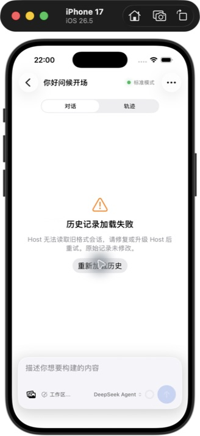
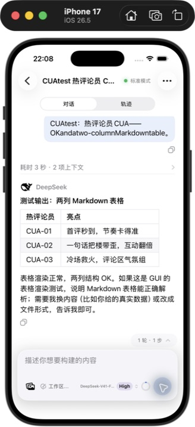
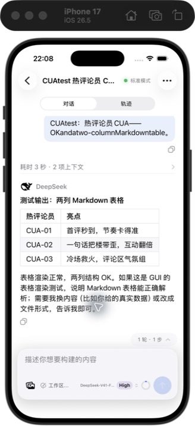

# 历史会话与错误恢复回归记录（2026-09-14）

> 后续更新：本记录首轮遗留的 Host origin 迁移问题现已在本机修复；原失败会话通过 Computer Use 打开及重进验证，原始文件未变。修复范围、71 份历史验证和补丁应用方法见 [Host 迁移修复记录](host-origin-migration-repair.md)。以下保留首轮回归的观察结果，Android 等未完成项不因此改变。

## 环境与范围

- iPhone 17 模拟器，iOS 26.5；通过 Computer Use 实际点击运行。
- 本地 Host：`dsh --version` 与安装包均为 `0.1.5-rc.1`。用户确认继续使用该环境测试。网关 hello 声明的 rc.2 不是运行版本检测结果。
- 本地 Mobile Gateway：0.7.4 加工作区补丁。已备份运行文件、替换补丁并重启本地 `dsh web`。未升级 Host，未修改原始历史文件。
- 远端 Host `VM-0-4-ubuntu`：使用已有连接测试；没有升级或重启远端，也未独立核实其实际安装版本。
- Android：Pixel 9 / API 35 模拟器运行设备 UI 测试。Computer Use 无法识别独立模拟器窗口，Android Studio 的 Running Devices / Device Manager 未显示该设备，因此 Android 没有完成同等范围的实际点击联调。
- 本记录覆盖本次历史加载、实时回复、失败恢复相关路径。不能据此宣布所有产品功能或所有真机场景通过。

## 已确认的问题与修复

1. **Host 的旧会话迁移失败仍存在。** `你好问候开场` 的 format v0 数据包含迁移器拒绝的 `permission/preset.data.origin`，错误为 `SESSION_QUERY_PERSISTENCE_FAILED`。这是服务端读取失败，App 无法凭渲染修复。保留原始文件，未删除字段或篡改版本。Host 日志还显示该类旧数据会影响全文搜索。
2. **网关控制请求错误回包失去归属。** permission-options 读取历史失败后继续生成缺少有效权限数据的响应；context-usage / session-stats 的历史查询错误仍带 history 请求类型。修复为返回真实错误，保留原请求类型及 sessionId。控制投影查询只请求一条历史消息。
3. **确定性迁移失败被重复跟随重试。** 网关 follower 对明确的格式迁移拒绝停止自动重试，返回非重试 reset，避免无效循环。
4. **共享实时流层忽略首快照前的失败。** 在当前订阅尚未建立 streamId 时也处理 reset；保留 session/subscription 检查及新基线建立后的旧 stream 拒绝规则。
5. **两端将失败显示为空会话。** 增加会话级历史错误状态，失败后展示错误页及重试入口；重试开始、成功快照到达后清除错误。iOS 另外阻止离开会话后的控制请求超时弹窗。

本次未重新加入磁盘历史缓存。原有首屏等待、投影发布后撤罩、小首屏快照与向前分页的修改继续保留。

## 实际操作结果

| 用例 | 结果 | 观察与限制 |
| --- | --- | --- |
| 打开本地旧格式失败会话 | 复现，Host 问题保留 | 修复前出现未确认权限请求、空会话；修复后返回真实迁移错误 |
| 关闭错误弹窗 | 通过 | 显示“历史记录加载失败”，不显示空会话欢迎页；有重新加载按钮 |
| 点击重新加载历史 | 通过失败恢复路径 | 新网关返回真实迁移错误；仍保留错误页。数据迁移本身未修复 |
| 退出失败会话后停留列表 | 本次通过 | 未再次出现原先 session-stats / permission-options 延迟错误提示 |
| 本地服务重启后恢复连接 | 通过空闲重连路径 | 出现一次 Socket 未连接提示；随后自动恢复认证连接。未在生成中重启 Host |
| 切换本地与远端 Host | 本次通过 | 分别显示对应会话列表，未观察到串会话 |
| 打开远端 Tell me a joke 长历史 | 本次通过 | 首次观察到加载遮罩，随后显示内容；未做精确首屏耗时测量 |
| 已有内容时重新加载历史 | 本次通过 | 保留内容，未观察到空会话闪烁；离散截图不排除帧级闪烁 |
| 查看长历史、切换轨迹 | 本次通过 | 正文、代码内容及轨迹工具节点可见 |
| 新建测试会话 | 通过 | 新会话显示正确空状态，模型及权限加载正常 |
| 发送消息、回复完成 | 通过 | 观察到停止按钮和最终回复，结束后恢复发送状态；未出现流验证错误或重复最终回复 |
| Markdown 表格实时显示 | 通过 | 两列表格按网格渲染 |
| 返回列表再打开表格会话 | 通过 | 表格和消息正常显示，没有重复最终回复；该次重进可能使用进程内已有内容 |
| 长回复期间停止生成 | 通过控制路径 | 点击停止后恢复发送状态，没有错误弹窗；不据此断言所有中断内容样式正确 |
| 生成中离开再进入会话 | 通过最终恢复路径 | 列表先显示运行中，重入时已取得最终内容，没有序号验证错误；未捕获重入后的逐 token 过程 |
| 打开模型、推理等级、权限菜单 | 通过读取路径 | 选项显示正常；未改变权限或调用工具审批 |
| 长历史上翻触发实际网络分页 | 未完成证明 | 上翻操作与可访问性树能看到较早内容，但部分滚动操作未可靠改变可见位置；现有 history 日志混有控制查询，不能证明 beforeSeq 分页已触发。分页边界由自动化测试覆盖 |
| Android 实际点击完整联调 | 工具受阻 | Computer Use 无可用 Android 模拟器目标。以下设备 UI 测试不能替代完整实际联调 |
| 真机、生成中网络断开、附件上传、工具审批、fork、删除/归档 | 本轮未执行 | 不纳入本轮通过项，未触碰用户数据或发送附件 |

测试创建了一条 `CUAtest 热评论员 CUA 表格` 会话（session-6761e103 前缀），包含表格和童话回复，未删除。模拟器输入法会转换英文，首次消息采用实际提交的无副作用表格测试文本；后续消息核对为禁止调用工具及修改文件的测试提示。

## 自动化验证

从测试结果文件核对：

| 测试 | 结果 |
| --- | --- |
| iOS XCTest | 165 通过，0 失败，0 跳过 |
| KMP shared | 168 通过，0 失败，0 跳过 |
| Android 单元测试 | 95 通过，0 失败，0 跳过 |
| Android 设备 Compose UI | 3 通过：加载遮罩、真正空会话、失败页及重试 |
| Android 构建和 lint | 通过 |
| Gateway npm test | 全部测试脚本通过，包含控制请求错误归属及不可重试迁移失败回归 |
| 两个仓库 git diff --check | 通过 |

新增回归覆盖：首快照前 reset、旧订阅隔离、失败页重试恢复、小首屏向前分页时不回退实时游标和不重复消息。自动化结果不等同于新版 Host 与两端真机联调完成。

本地完整结果：`/tmp/dsh-cua-regression/ios.xcresult`、`/tmp/dsh-cua-regression/gateway-tests.log`、`/tmp/dsh-cua-regression/android-device.log`，以及两模块 build/test-results。

## 界面证据

## 交付状态

App、共享层及网关源码均为本地未提交修改；模拟器安装了本次 App 构建，本地网关运行实例已加载补丁。运行文件备份在 `/tmp/dsh-cua-regression/runtime-backup`。没有发布版本，也没有修改远端网关。
