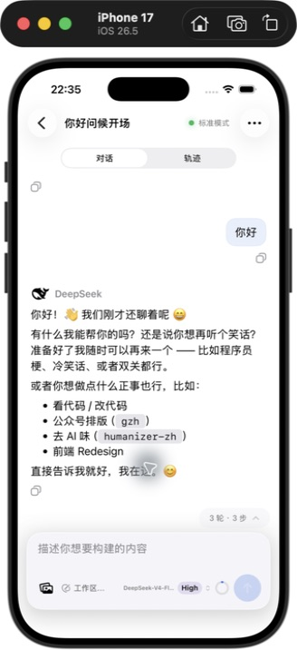

# Host 旧历史 origin 迁移修复

2026-09-14 后续处理：截图中的 `你好问候开场` 已恢复。本机 Host 已应用补丁并重启，Computer Use 验证首次打开和退出重进均能显示三轮历史、模型和权限，未再出现迁移拒绝。远端 Host 尚未应用此补丁。

## 根因及兼容范围

本机旧 v0 历史包含 `permission/preset.data.origin`：扫描得到 `default` 45 次、`selection` 22 次。Host 的 `@deepseek-ai/dsh-session-format-v0-to-v1` 迁移包白名单只允许 `preset`，因此在第一个权限事件就拒绝整个会话。

修复只增加可选 `origin` 字段，并限定为上述两种已确认的字符串。权限预设、沙箱模式和审批策略保持原值；未知字段、未知 origin、错误类型和缺少 preset 的数据仍会拒绝。字段随 v0 → v1 → v2 → v3 全程保留，不通过删除原始字段绕过校验。

该白名单由后续版本的迁移和验证逻辑复用，因此只修改 v0-to-v1 包的字段声明和语义校验两处。不是修改手机协议，也不需要让 App 读取旧格式文件。

## 已执行验证

- 未修复的完整迁移链在原会话副本上复现同一 origin 错误。
- 修复后，本机 71 份 v0 历史全部通过严格迁移检查，没有写回这些扫描输入。
- 12 项迁移检查通过：两种 origin、无 origin、非法类型及未知字段拒绝、真实样本比较和 v3 编码后重读。
- 原会话 82 条物理记录迁移为 36 条 v3 事件；旧的压缩 chunk 记录在标准迁移过程中合并，因此两种计数不同。剔除仅用于对照的 origin 元数据后，完整迁移结果与原迁移器处理无 origin 副本的结果完全一致。
- 补丁安装器 2 项测试通过：代码基线校验、重复执行、默认只检查、先备份、原子替换不污染共享硬链接。
- 本机安装包再次运行同一套 12 项检查通过。
- App 实际打开原失败会话后，Host 正常生成 `session.v3.jsonl.zstd`；持久化文件还包含 `session/end-seed` 收尾记录，共 38 条物理记录、37 条解码事件。实际生成的文件也通过严格解码及编码重读检查。
- 退出重进会话通过；重启后的 Host 日志没有 `refuses this format`，搜索请求也成功返回。

原文件 `session.jsonl.zstd` SHA-256 保持：

```text
c089dd462ba78a28109b2ecfcb8a63727b8f9d787ed07f50e6bc46181231da28
```



## 可重复应用的补丁

脚本保存在 `scripts/patch-host-origin-migration.mjs`。只支持已验证的迁移包 0.1.5-rc.1 / rc.2，并检查两处具体代码；不满足条件时停止，不做猜测性替换。默认只检查，`--apply` 才写入。它不读取或修改会话文件，也不自动停止任何进程。

示例适用于 npm 全局安装的 Host，必须指向实际运行 Host 使用的包目录：

```sh
migration_package="$(npm root -g)/@deepseek-ai/dsh/node_modules/@deepseek-ai/dsh-session-format-v0-to-v1"
node scripts/patch-host-origin-migration.mjs --package "$migration_package"
node scripts/patch-host-origin-migration.mjs --package "$migration_package" \
  --backup-dir "$HOME/.dsh/patch-backups/session-origin" --apply
```

应用后在没有活动任务时正常重启对应 Host，使主进程与持久化 worker 均加载补丁。不要改会话的版本号，也不要手工覆盖旧日志。本机已完成该操作。

独立验证（Node.js 及 zstd CLI）：

```sh
node --test scripts/patch-host-origin-migration.test.mjs
node scripts/verify-host-origin-migration.mjs \
  --modules-root "$(npm root -g)/@deepseek-ai/dsh/node_modules" \
  --fixture /绝对路径/会话副本/session.jsonl.zstd
```

真实 fixture 必须包含 origin 权限事件。Session 使用拼接 zstd 帧，验证脚本用 zstd CLI 完整解码，拒绝只拿到文件头的假通过。

## 本机安装状态和备份

- 当前 Host 启动包仍为 0.1.5-rc.1，其实际迁移依赖版本为 0.1.5-rc.2。
- 修改文件：Host 安装目录下 `node_modules/@deepseek-ai/dsh-session-format-v0-to-v1/lib/index.js`。
- 原代码备份：`~/.dsh/patch-backups/session-origin-20260914/15ae26b90310d83b1b90a5e7cad9e2f34282fddaba2f19f2fd2232382065603d.index.js`。
- 补丁后代码 SHA-256：`48a91a70373855bc6e747f8a2ae7a1378f76208d5170b887707979e55107128a`。
- 工作区脚本和文档尚未提交或发布。这是本地 Host 兼容补丁；重新安装或升级 Host 可能覆盖它。后续应使用包含等价修复的上游版本，不能默认把此脚本套用到未知版本。

若需回退代码，应先停止该 Host，再从上述备份以临时文件加 rename 的方式恢复模块；新生成的 v3 会保留 origin，旧的未修复模块仍会拒绝这类字段，因此回退代码不会解决历史读取问题，不应删改历史来配合回退。
