<div align="center">

# DeepSeek Harness Mobile

**在 iPhone 上延续 DeepSeek Harness 的原生工作流。**

一个使用 SwiftUI 构建的 DeepSeek Harness iOS 客户端，在移动端还原 WebUI 的对话、轨迹与工作区体验。


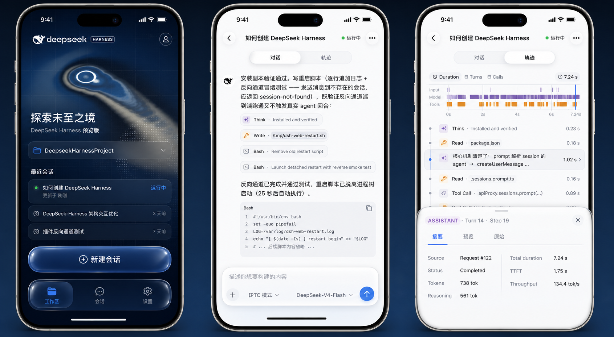

</div>

## 项目简介

DeepSeek Harness Mobile 是一个面向 DeepSeek Harness 的原生 iOS 客户端。它通过 `dsh-plugin-mobile-gateway` 与 Harness 建立 WebSocket 连接，将工作区、会话、实时回复和 Agent 执行轨迹带到 iPhone，同时延续 DeepSeek WebUI 克制、清晰的视觉语言。

界面提供浅色与深色模式，并在支持的系统上使用 Liquid Glass 导航与交互控件；深色首页则以深海蓝、水波纹、网格和点阵鲸鱼构成与 Harness 官网一致的视觉氛围。

## 功能亮点

- **原生实时对话**：接收 WebSocket 增量事件，逐步展示正文、思考过程、工具调用和工具结果。
- **历史与实时解耦**：大量历史记录分页合并时，实时尾部仍可独立更新，避免阻塞生成和用户滚动。
- **智能吸底**：停留在底部时跟随新内容；用户主动浏览历史后停止抢夺滚动位置。
- **完整轨迹视图**：查看 Duration、Turns、Calls、Input、Model、Tools 时间线，并展开单条记录的参数、结果、Schema 与耗时。
- **工作区与会话管理**：浏览目录、创建或切换工作区，搜索会话并创建新会话。
- **会话配置**：切换当前会话的模型、思考等级与访问权限。
- **全局默认配置**：设置新会话默认使用的 Agent 预设、权限、模型和思考等级，并与 WebUI 使用同一部署配置。
- **安全配对**：支持扫描 WebUI 二维码或手动连接；长期凭据保存在系统安全存储中。
- **移动端交互**：对话与轨迹页面常驻并支持左右滑动切换，保留各自的滚动位置和页面状态。

## 界面预览

### 核心体验

<table>
  <tr>
    <td width="33.33%" align="center">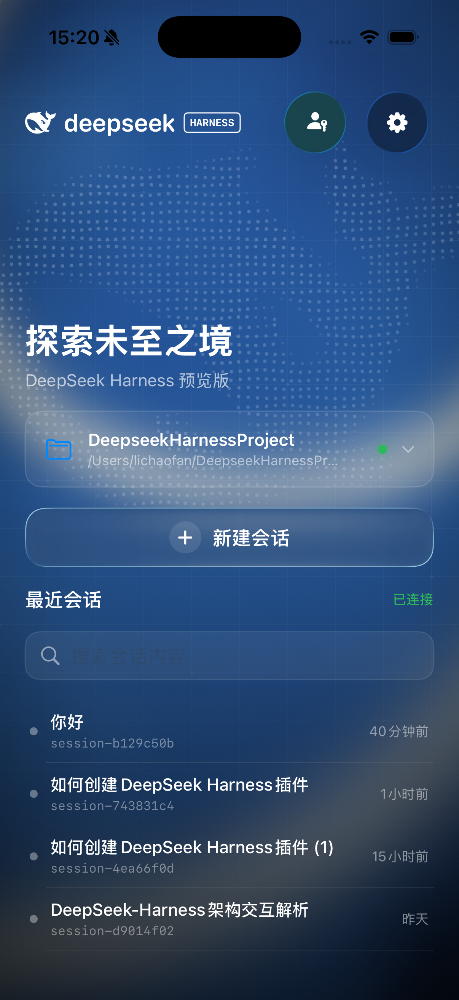</td>
    <td width="33.33%" align="center">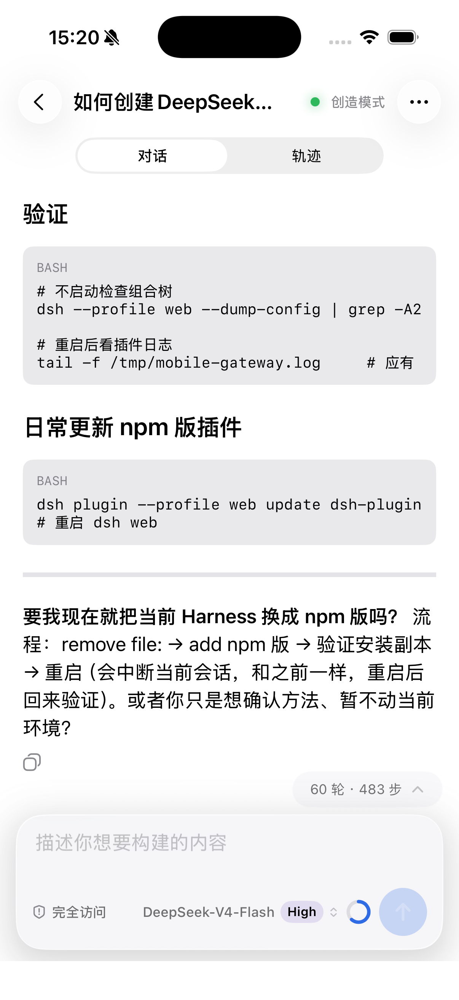</td>
    <td width="33.33%" align="center">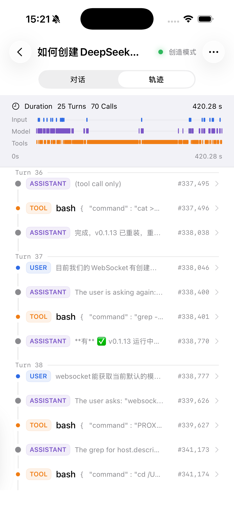</td>
  </tr>
  <tr>
    <td align="center"><strong>工作区首页</strong><br>Harness 视觉与最近会话</td>
    <td align="center"><strong>对话</strong><br>Markdown、代码与工具结果</td>
    <td align="center"><strong>轨迹</strong><br>时间概览与事件时间线</td>
  </tr>
</table>

### 默认配置

<table>
  <tr>
    <td width="33.33%" align="center">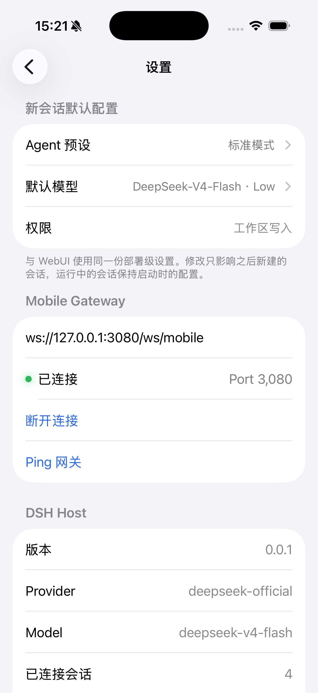</td>
    <td width="33.33%" align="center">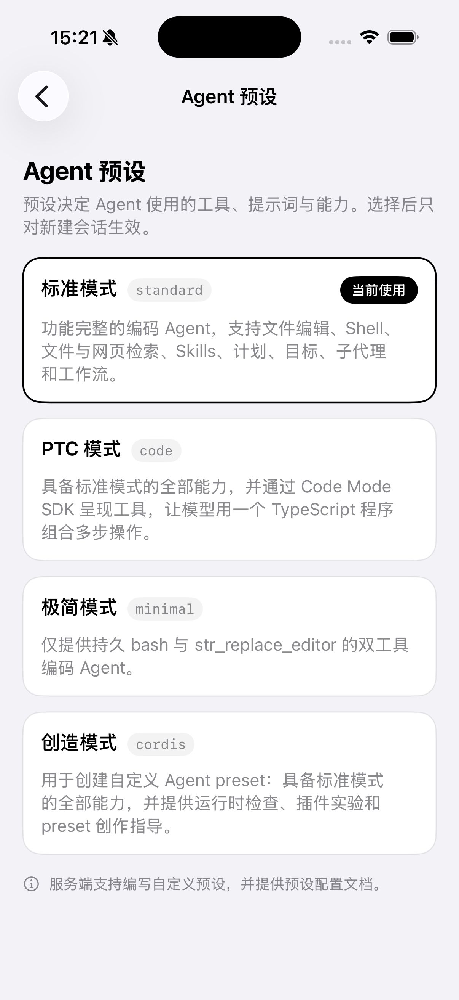</td>
    <td width="33.33%" align="center">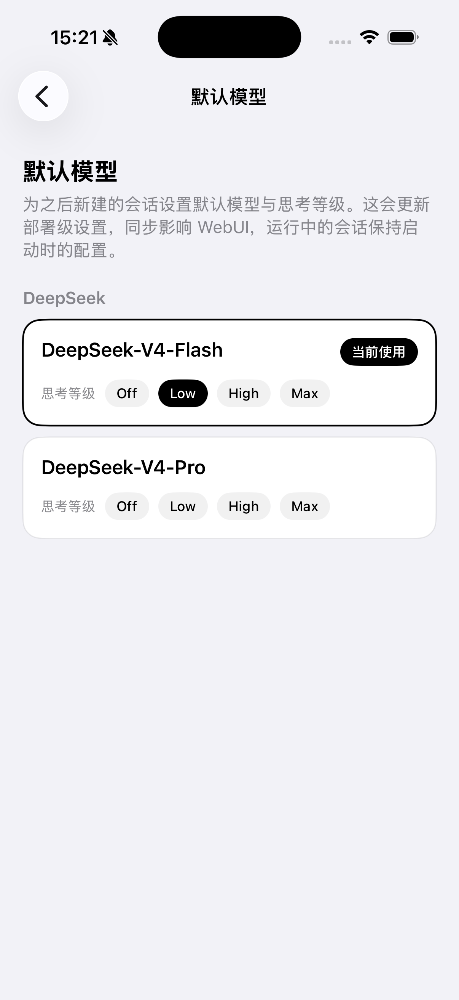</td>
  </tr>
  <tr>
    <td align="center"><strong>设置</strong><br>部署默认值与网关状态</td>
    <td align="center"><strong>Agent 预设</strong><br>工具、提示词与能力组合</td>
    <td align="center"><strong>默认模型</strong><br>模型与思考等级</td>
  </tr>
</table>

### 工作区操作与轨迹详情

<table>
  <tr>
    <td width="33.33%" align="center">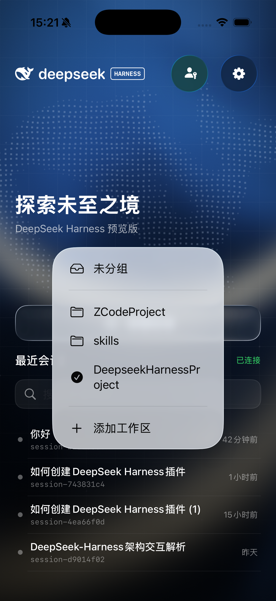</td>
    <td width="33.33%" align="center">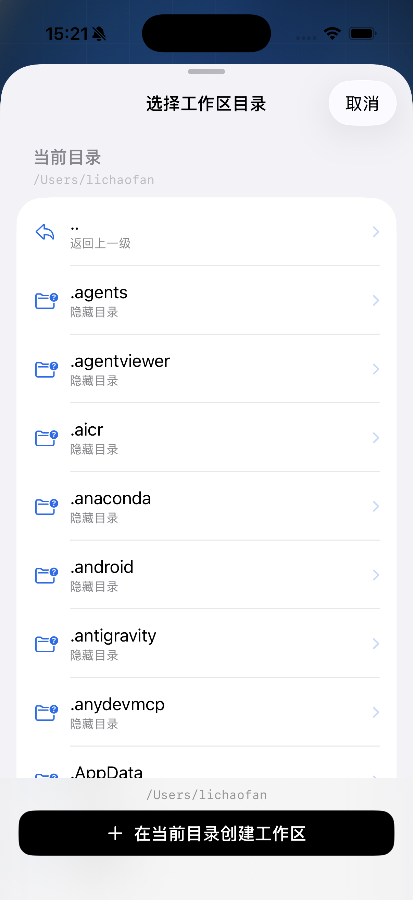</td>
    <td width="33.33%" align="center">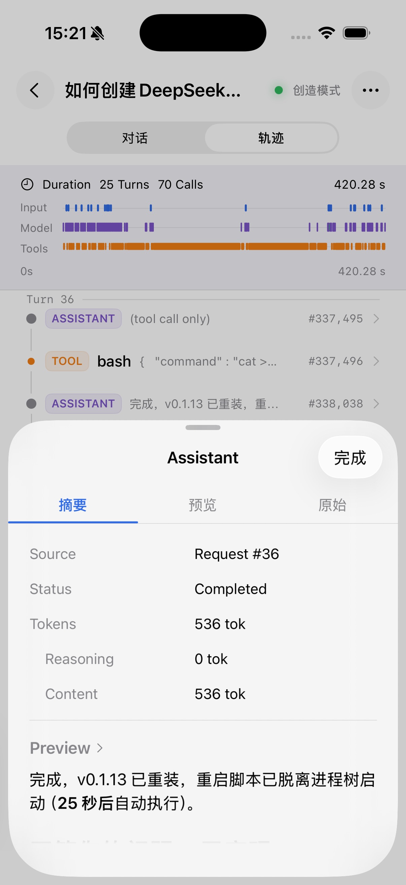</td>
  </tr>
  <tr>
    <td align="center"><strong>切换工作区</strong><br>快速访问不同项目</td>
    <td align="center"><strong>目录选择</strong><br>浏览并创建工作区</td>
    <td align="center"><strong>轨迹详情</strong><br>摘要、Token 与内容预览</td>
  </tr>
</table>

### 浅色、深色与设备配对

<table>
  <tr>
    <td width="33.33%" align="center">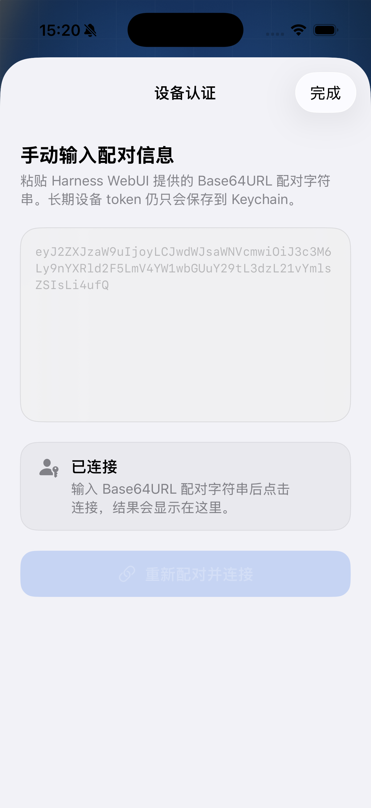</td>
    <td width="33.33%" align="center">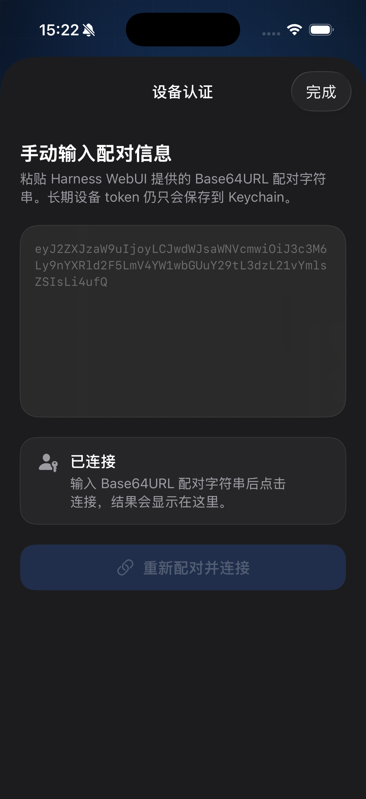</td>
    <td width="33.33%" align="center">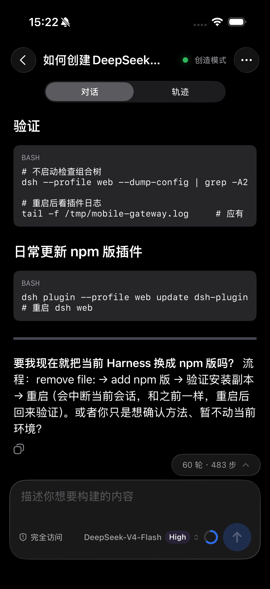</td>
  </tr>
  <tr>
    <td align="center"><strong>浅色配对</strong><br>手动输入配对信息</td>
    <td align="center"><strong>深色配对</strong><br>完整深色模式适配</td>
    <td align="center"><strong>深色对话</strong><br>阅读、代码与输入面板</td>
  </tr>
</table>

## 功能详解

### 对话与轨迹

同一个 Session 内可以在“对话”和“轨迹”之间点击或横向滑动切换。两个页面保持独立生命周期，切换时不会重新加载已有内容。

- 对话页支持 Markdown、代码块、实时 reasoning、工具摘要和工具结果。
- 轨迹页以角色标签和时间轴组织 User、Assistant、Tool 等事件。
- 点击轨迹记录可从 Bottom Sheet 查看请求摘要、原始参数、结果、Token 用量与耗时。

### Agent、模型与权限

应用既能调整当前会话，也能维护之后新建会话使用的部署级默认值：

| 配置 | 能力 |
| --- | --- |
| Agent 预设 | 读取可用预设并设为全局默认值 |
| 默认模型 | 选择 Provider、模型与默认思考等级 |
| 会话模型 | 在运行中的 Session 内切换模型和 reasoning effort |
| 权限 | 支持 `read-only`、`workspace-write`、`danger-full-access` |

### 配对与可信设备

移动端可扫描 WebUI 生成的一次性二维码完成配对。公网地址必须使用 `wss://`，配对码仅可使用一次并会在短时间后过期；已配对设备可在网关管理界面中查看和管理。

<p align="center">
  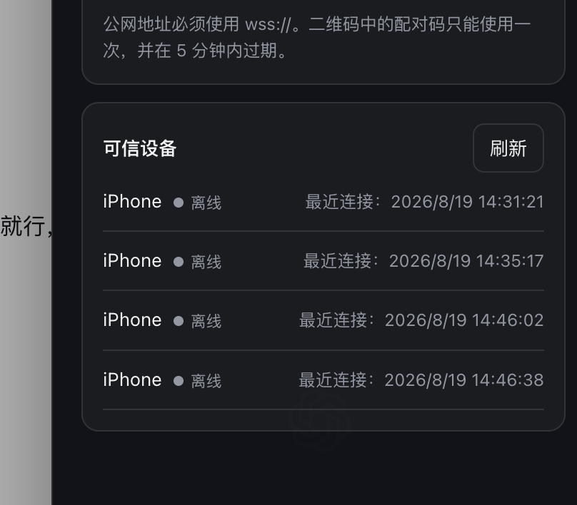
</p>

## 技术实现

```text
DeepSeek Harness
       │
       │  dsh-plugin-mobile-gateway
       │  WebSocket / history / configuration
       ▼
URLSessionWebSocketTask
       │
       ├── Workspaces & Sessions
       ├── Historical pages
       ├── Live event tail
       └── Defaults & Presets
       ▼
SwiftUI + UIKit interoperability
```

- SwiftUI 原生界面，必要位置与 UIKit 协作以获得稳定的分页、滚动和增量渲染体验。
- 历史分页与实时事件尾部采用独立数据路径，再按事件身份安全合并。
- 已渲染消息保持稳定，流式传输时只更新正在生成的内容块。
- iOS 26 及以上使用系统 Liquid Glass 能力，较早系统使用视觉一致的材质回退。

## 运行项目

### 环境要求

- macOS 与可构建 iOS 17.0+ 的 Xcode
- iOS 17.0+ 模拟器或真机
- 已启用 `dsh-plugin-mobile-gateway` 的 DeepSeek Harness

### 启动步骤

1. 启动 DeepSeek Harness，并确认 `dsh-plugin-mobile-gateway` 已加载。
2. 使用 Xcode 打开 `DeepSeekHarnessMobile.xcodeproj`。
3. 选择 `DeepSeekHarnessMobile` Scheme 和目标设备后运行。
4. 在应用中扫描 WebUI 配对二维码，或手动填写网关地址。

本机调试时常用的连接地址：

| 场景 | 地址 |
| --- | --- |
| iOS Simulator | `ws://127.0.0.1:3080/ws/mobile` |
| 同一局域网内的 iPhone | `ws://<Mac-LAN-IP>:3080/ws/mobile` |
| 公网部署 | `wss://<your-domain>/ws/mobile` |

> [!NOTE]
> 真机不能使用 `127.0.0.1` 访问 Mac，请改用 Mac 的局域网 IP；公网部署应在网关前配置 TLS 反向代理。

## 项目文档

- [架构说明](ARCHITECTURE.md)
- [Harness / WebUI 功能与协议调研](Docs/exploration.md)
- [移动端设计规范](Design/design-spec.md)

## 当前状态

项目仍处于开发阶段，协议与界面会随 DeepSeek Harness 持续演进。它是面向 Harness 的社区原生客户端，不代表 DeepSeek 官方发布。
